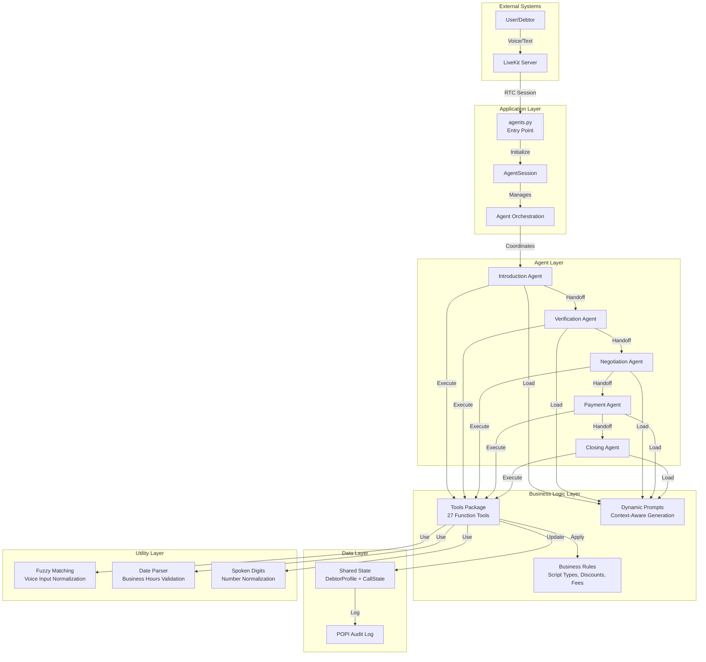
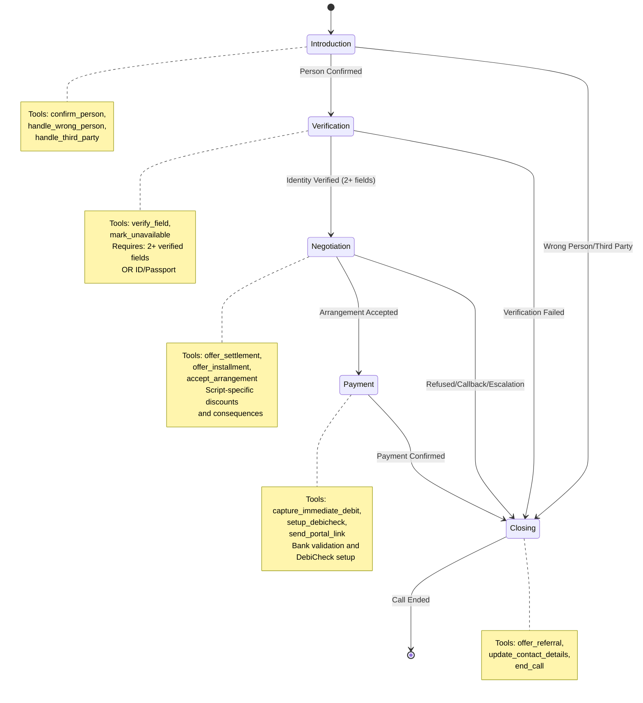
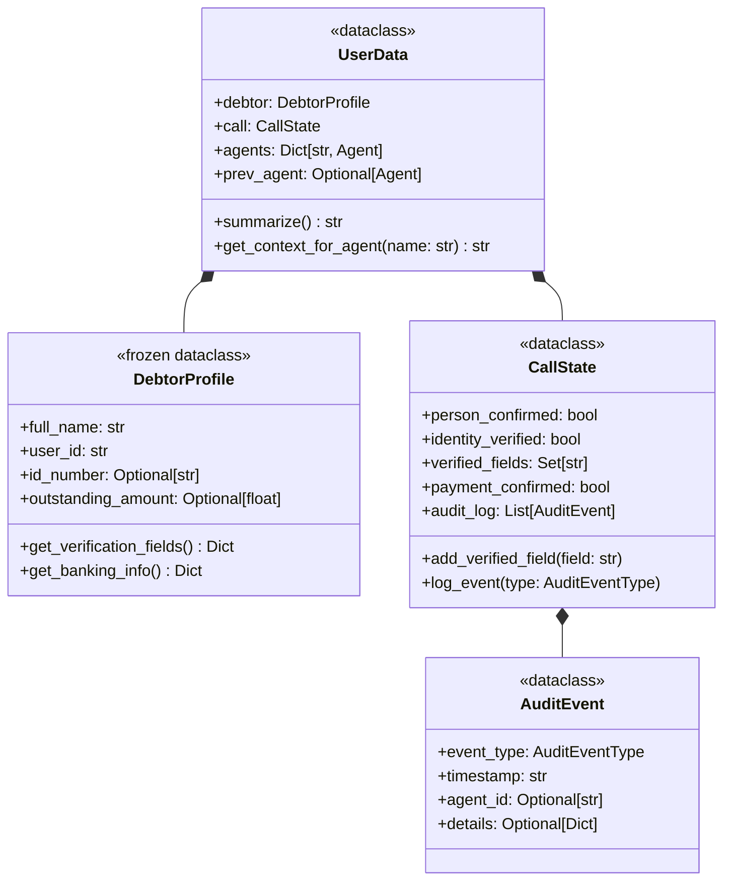
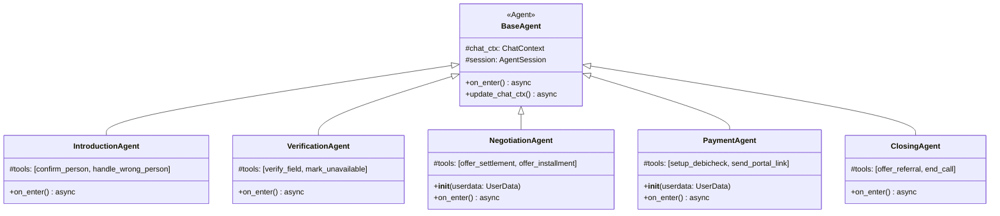
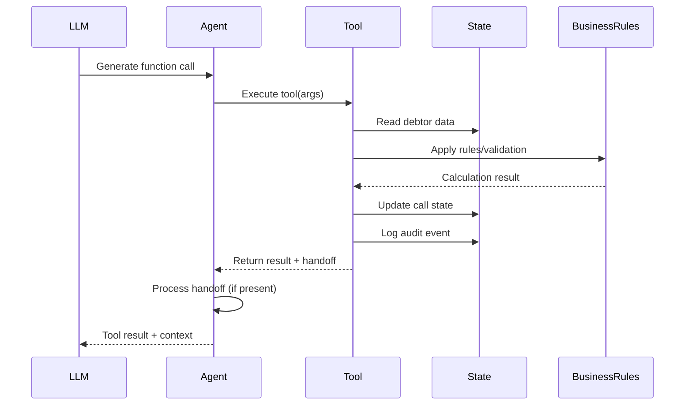
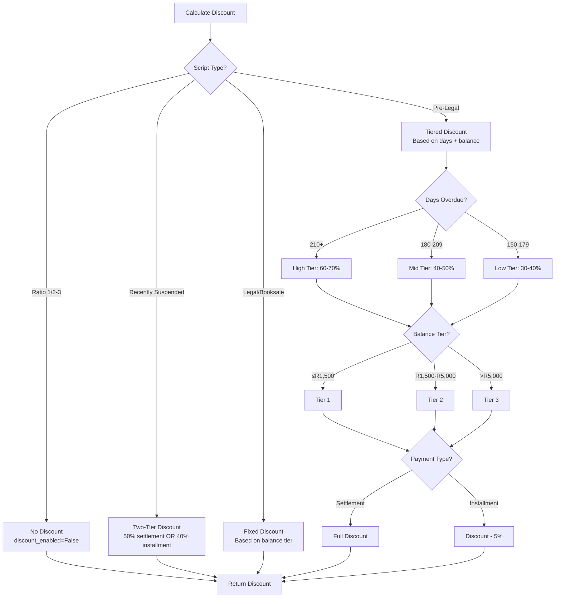
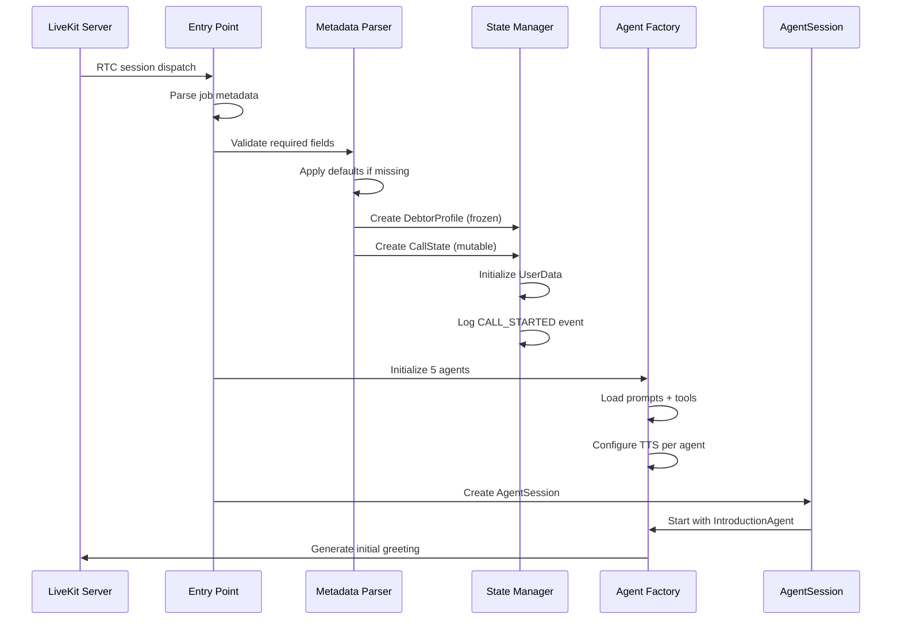
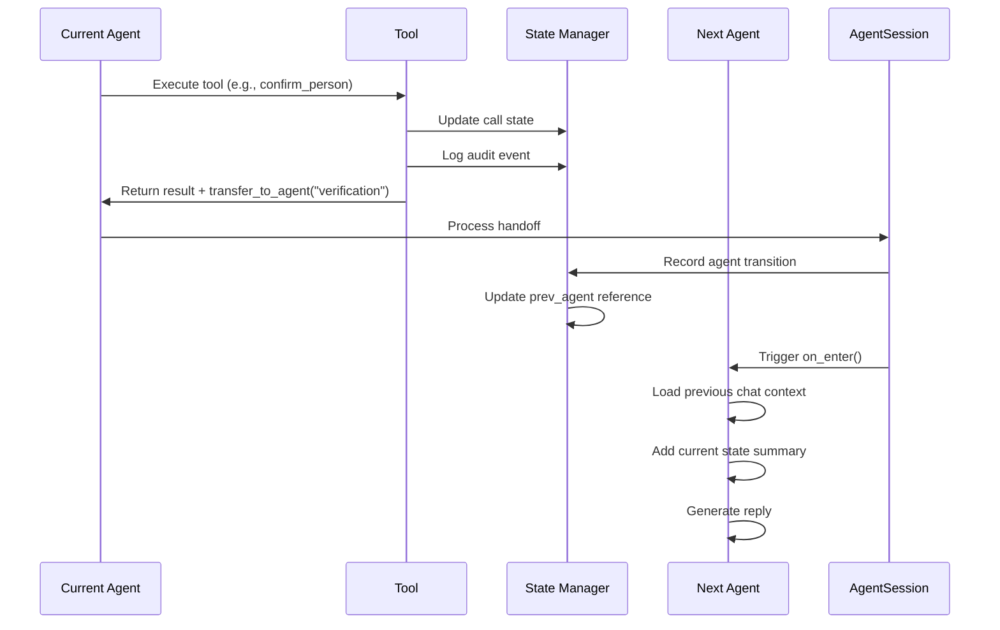
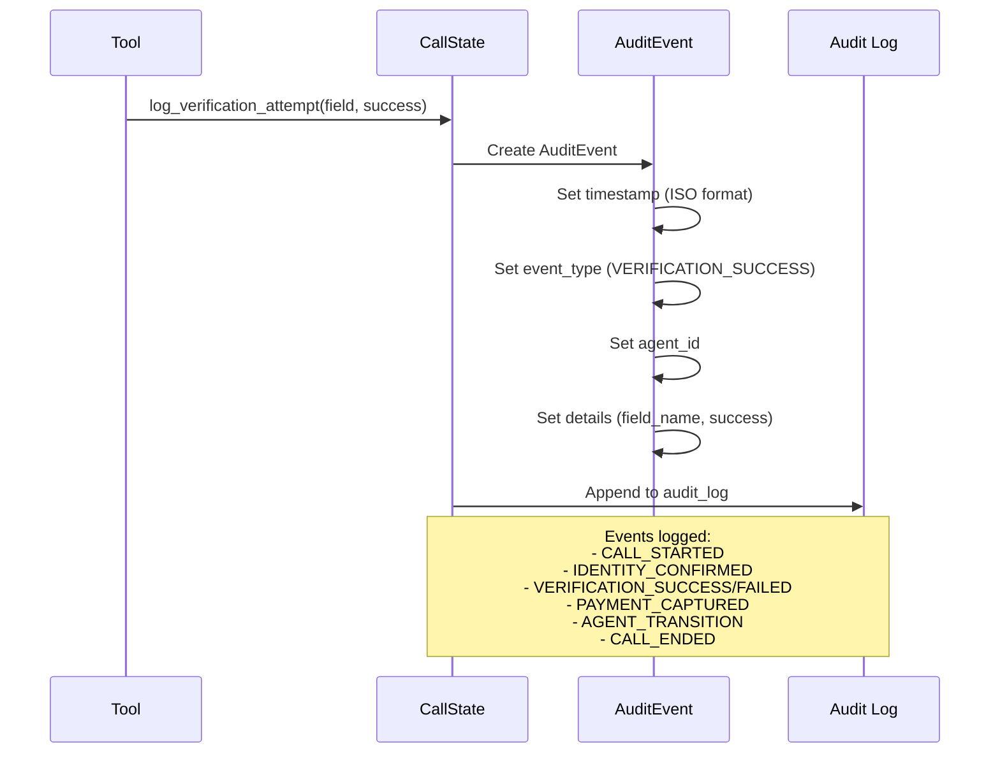

# Architecture Documentation

## System Overview

The Debt Collection Multi-Agent System is a POPI-compliant voice agent application built on the LiveKit Agents SDK. It orchestrates five specialized sub-agents through a structured debt collection workflow, ensuring regulatory compliance while maximizing payment collection efficiency.

### High-Level Architecture



## Multi-Agent Workflow

### Agent Transition Flow



### Agent Responsibilities

| Agent | Purpose | Entry Criteria | Exit Criteria | Next Agent |
|-------|---------|----------------|---------------|------------|
| **Introduction** | Confirm debtor identity and establish contact | Call starts | Person confirmed OR wrong person/third party | Verification OR Closing |
| **Verification** | POPI-compliant identity verification | Person confirmed | 2+ fields verified OR verification failed | Negotiation OR Closing |
| **Negotiation** | Explain debt, consequences, offer payment options | Identity verified | Arrangement accepted OR refusal/escalation | Payment OR Closing |
| **Payment** | Capture payment details and setup payment method | Arrangement accepted | Payment confirmed | Closing |
| **Closing** | Wrap up call, referrals, contact updates | Any terminal condition | Call ended | [End] |

## Component Architecture

### 1. Entry Point (`agents.py`)

**Responsibilities:**
- LiveKit RTC session management
- Job metadata parsing and validation
- Agent initialization and orchestration
- Error handling and logging
- Test data provisioning for development

**Key Functions:**
```python
@server.rtc_session(agent_name=get_agent_id())
async def entrypoint(ctx: JobContext):
    # Load debtor data from job metadata
    # Initialize shared state (DebtorProfile + CallState)
    # Create all 5 agents with TTS configuration
    # Start AgentSession with IntroductionAgent
```

### 2. Shared State (`shared_state.py`)

**Architecture Pattern:** Immutable debtor data + Mutable call state



**Design Rationale:**
- **DebtorProfile is frozen**: Ensures immutability of source data, preventing accidental modification
- **CallState is mutable**: Tracks dynamic call progression and state changes
- **UserData aggregates both**: Single source of truth for session state
- **Audit log built-in**: POPI compliance logging at the state layer

### 3. Agent Layer (`sub_agents/`)

**Base Architecture:**



**Context Preservation on Handoffs:**

Each agent preserves conversation context when transitioning:

```python
async def on_enter(self) -> None:
    userdata: UserData = self.session.userdata
    chat_ctx = self.chat_ctx.copy()

    # Import previous agent's chat history
    if isinstance(userdata.prev_agent, Agent):
        truncated_chat_ctx = userdata.prev_agent.chat_ctx.copy(
            exclude_instructions=True,
            exclude_function_call=False
        ).truncate(max_items=CHAT_CONTEXT_MAX_ITEMS)
        chat_ctx.items.extend(truncated_chat_ctx.items)

    # Add current state as system message
    chat_ctx.add_message(
        role="system",
        content=f"Current call state:\n{userdata.summarize()}"
    )

    await self.update_chat_ctx(chat_ctx)
```

### 4. Tools Layer (`tools/`)

**Tool Organization:**

```
tools/
├── __init__.py              # TOOL_REGISTRY + get_tools_by_names()
├── common_tools.py          # Cross-agent tools (schedule_callback, escalate, transfer_to_agent)
├── tool01_introduction.py   # Identity confirmation tools
├── tool02_verification.py   # POPI verification tools
├── tool03_negotiation.py    # Payment arrangement tools
├── tool04_payment.py        # Payment processing tools
└── tool05_closing.py        # Call closure tools
```

**Tool Registry Pattern:**

```python
TOOL_REGISTRY = {
    "confirm_person": confirm_person,
    "verify_field": verify_field,
    "offer_settlement": offer_settlement,
    # ... 27 total tools
}

def get_tools_by_names(tool_names: list[str]) -> list:
    return [TOOL_REGISTRY[name] for name in tool_names if name in TOOL_REGISTRY]
```

**Tool Execution Flow:**



### 5. Business Rules Layer (`business_rules/`)

**Module Structure:**

```python
# config.py
AUTHORITIES = {
    "cartrack": {"name": "Cartrack Accounts", "contact": "011-250-3000"},
    "viljoen": {"name": "Viljoen Attorneys", "contact": "010-140-0085"}
}

SCRIPT_TYPES = {
    "ratio1_inflow": {
        "authority": "cartrack",
        "discount_enabled": False,
        "max_payments": 2,
        "consequence_level": "none"
    },
    "prelegal_150": {
        "authority": "viljoen",
        "discount_enabled": True,
        "max_payments": 3,
        "consequence_level": "attorney",
        "discount_tiers": {...}
    },
    # ... 12 total script types
}

FEES = {
    "DEBICHECK_FEE": 10.0,
    "CREDIT_CLEARANCE_FEE": 1800.0,
    "RECOVERY_FEE": 25000.0
}

INSTALLMENT_RULES = {
    "tier1": {"max_balance": 1500.0, "min_months": 3},
    "tier2": {"min_balance": 1500.01, "max_balance": 5000.0, "min_months": 4},
    "tier3": {"min_balance": 5000.01, "min_months": 6}
}
```

**Discount Calculation Architecture:**



### 6. Prompt System (`prompts/`)

**Dynamic Prompt Generation:**

```python
# prompts/__init__.py

def get_negotiation_prompt(userdata: UserData, variables: dict) -> str:
    """Generate negotiation prompt based on script type, account status, and debtor data."""
    script_type = userdata.call.script_type
    script_config = SCRIPT_TYPES[script_type]

    # Load base prompt template
    base_prompt = load_base_prompt("prompt03_negotiation.yaml")

    # Generate script-specific context
    script_context = generate_script_context(script_config, userdata.debtor)

    # Generate consequence messaging
    consequence_msg = generate_consequence_message(script_config["consequence_level"])

    # Generate discount context (if applicable)
    discount_context = ""
    if script_config.get("discount_enabled"):
        discount_context = generate_discount_context(script_type, userdata.debtor)

    # Assemble final prompt
    return f"{base_prompt}\n\n{script_context}\n\n{consequence_msg}\n\n{discount_context}"
```

**Prompt Sanitization (Security):**

```python
def sanitize_for_prompt(value: Any, max_length: int = 200) -> str:
    """Prevent prompt injection by sanitizing customer data."""
    if value is None:
        return "N/A"

    text = str(value)

    # Remove control characters
    text = re.sub(r'[\x00-\x1f\x7f-\x9f]', '', text)

    # Collapse whitespace
    text = re.sub(r'\s+', ' ', text).strip()

    # Truncate to max length
    if len(text) > max_length:
        text = text[:max_length] + "..."

    return text
```

Applied to all 43 customer data injection points.

## Data Flow Architecture

### Call Initialization Flow



### Agent Handoff Flow



### POPI Audit Flow



## Technology Stack

### Core Framework
- **LiveKit Agents SDK**: Real-time voice agent framework with multi-agent support
- **Python 3.8+**: Primary runtime environment

### AI/ML Services
- **LLM**: OpenAI GPT-4o-mini (configurable temperature: 0.7)
- **STT**: Deepgram Nova-2 (speech-to-text)
- **TTS**: Cartesia (primary), with support for custom plugins (Chatterbox, Kokoro, Supertonic)
- **VAD**: Silero Voice Activity Detection
- **Turn Detection**: Multilingual model for conversation flow

### Data Management
- **State Management**: In-memory dataclasses (DebtorProfile, CallState, UserData)
- **Configuration**: YAML-based (agent.yaml for structure, prompt YAMLs for content)
- **Audit Logging**: Timestamped event stream with POPI compliance

### Utilities
- **Fuzzy Matching**: Voice input normalization and similarity matching (Levenshtein distance)
- **Date Parsing**: Business hours validation (Mon-Sat 07:00-18:00 SAST)
- **Input Normalization**: Spoken digit conversion ("oh" → "0")

## Scalability Considerations

### Horizontal Scaling

**Agent Workers:**
- Multiple agent worker instances can run in parallel
- LiveKit server dispatches sessions to available workers
- Each worker maintains isolated session state (no shared memory)
- Stateless design enables elastic scaling

**Recommended Deployment:**
```
[LiveKit Server] --> Load Balancer --> [Worker 1]
                                  --> [Worker 2]
                                  --> [Worker N]
```

### Performance Optimization

**Current Bottlenecks:**
1. **LLM Latency**: GPT-4o-mini responses (200-500ms average)
   - Mitigation: Use streaming responses, optimize prompts
2. **TTS Latency**: Text-to-speech generation (100-300ms per utterance)
   - Mitigation: Pre-cache common phrases, use faster TTS models
3. **Fuzzy Matching**: O(n*m) complexity for Levenshtein distance
   - Mitigation: Limit string length, use approximate matching thresholds

**Optimization Strategies:**
- **Prompt Caching**: Cache static prompt templates
- **Tool Result Caching**: Cache discount calculations for common scenarios
- **Connection Pooling**: Reuse HTTP connections to external APIs
- **Async Operations**: All I/O operations are async (already implemented)

### Resource Requirements

**Per Agent Worker:**
- CPU: 2 cores (recommend 4 for production)
- Memory: 512MB base + 100MB per concurrent session
- Network: 50-100 Kbps per active voice session
- Storage: Minimal (logs only, no persistent storage required)

**Recommended Limits:**
- Max concurrent sessions per worker: 10-20
- Session timeout: 30 minutes (configurable)
- Tool execution timeout: 10 seconds (prevents hanging)

### Monitoring Metrics

**Key Metrics to Track:**
- **Session Metrics**: Total calls, successful completions, drop-off points
- **Agent Metrics**: Handoff success rate, verification pass rate, payment capture rate
- **Performance Metrics**: LLM latency, TTS latency, total call duration
- **Business Metrics**: Payment arrangements made, callback scheduled, escalations

**Observability Integration:**
```yaml
# agent.yaml
observability:
  tracing_enabled: true
  phoenix_endpoint: http://localhost:6006
  log_level: INFO
```

## Security Architecture

### Data Protection

**1. Prompt Injection Prevention:**
- All customer data sanitized before prompt injection
- Control characters removed, whitespace normalized
- Length truncation to prevent overflow
- Applied to 43 injection points across all prompts

**2. Input Validation:**
- Bank details validated against SA_BANKS whitelist
- Branch code format validation (6 digits)
- Account number format validation (8-12 digits)
- Amount validation (positive, max R1,000,000)

**3. POPI Compliance:**
- Comprehensive audit logging (13 event types)
- Timestamped events with agent attribution
- Exportable audit trail via `get_audit_summary()`
- Minimum data exposure (only necessary fields)

### Network Security

**Transport Security:**
- WebSocket connections over TLS (wss://)
- LiveKit API key/secret authentication
- No persistent storage of sensitive data
- Encrypted voice streams (SRTP)

### Secrets Management

**Environment Variables:**
```bash
LIVEKIT_URL=wss://your-server.com
LIVEKIT_API_KEY=your-api-key
LIVEKIT_API_SECRET=your-api-secret
OPENAI_API_KEY=your-openai-key
DEEPGRAM_API_KEY=your-deepgram-key
CARTESIA_API_KEY=your-cartesia-key
```

**Best Practices:**
- Never commit `.env` files
- Rotate API keys regularly
- Use secret managers in production (AWS Secrets Manager, HashiCorp Vault)
- Implement IP whitelisting for agent workers

## Extension Points

### Adding New Agents

1. Create agent class in `sub_agents/agent0X_name.py`
2. Inherit from `BaseAgent`
3. Add configuration to `agent.yaml`
4. Create prompt template in `prompts/prompt0X_name.yaml`
5. Register agent in `sub_agents/__init__.py`

### Adding New Tools

1. Create tool function with `@function_tool` decorator
2. Add to appropriate `tools/tool0X_*.py` file
3. Register in `TOOL_REGISTRY` in `tools/__init__.py`
4. Add tool name to agent configuration in `agent.yaml`

### Adding New Script Types

1. Add configuration to `SCRIPT_TYPES` in `business_rules/config.py`
2. Define discount rules, consequence level, max payments
3. Update `get_negotiation_prompt()` to handle new script type
4. Create test cases in `testcases/`

### Custom TTS Providers

1. Implement TTS plugin following LiveKit TTS interface
2. Add configuration to `TTS_CONFIG` in `sub_agents/base_agent.py`
3. Update `get_tts()` function to handle new provider
4. Configure voice IDs per agent type

## Future Architecture Considerations

### Potential Enhancements

1. **Multi-Tenancy**: Support multiple clients with isolated configurations
2. **Dynamic Script Loading**: Hot-reload script types without restarting workers
3. **Real-Time Sentiment Analysis**: Detect caller distress and adapt tone
4. **Callback Queue Management**: Integrate with external scheduling system
5. **Payment Gateway Integration**: Direct payment processing vs. portal links
6. **CRM Integration**: Sync call outcomes to external CRM systems
7. **Analytics Dashboard**: Real-time monitoring of agent performance
8. **A/B Testing Framework**: Test different prompts and conversation flows

### Migration Considerations

**From Monolithic to Microservices:**
- Separate business rules into dedicated service
- Extract discount calculator into pricing service
- Centralize audit logging in compliance service
- Use message queue (RabbitMQ, Kafka) for event streaming

**Database Integration:**
- Currently stateless (no persistent storage)
- Future: Persist call transcripts, audit logs, payment arrangements
- Recommended: PostgreSQL for structured data, S3 for audio recordings
